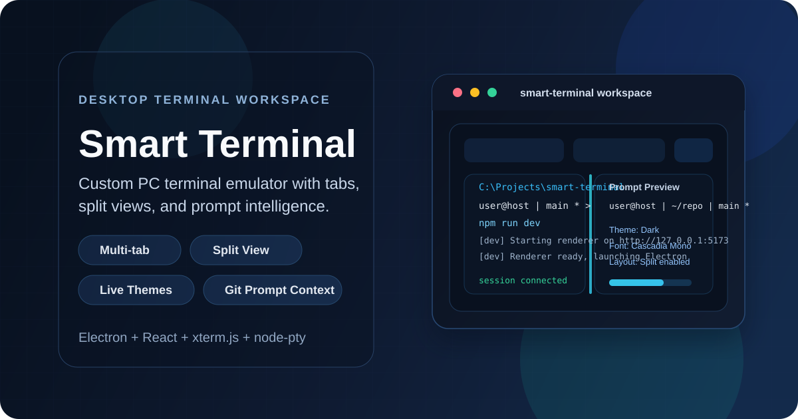
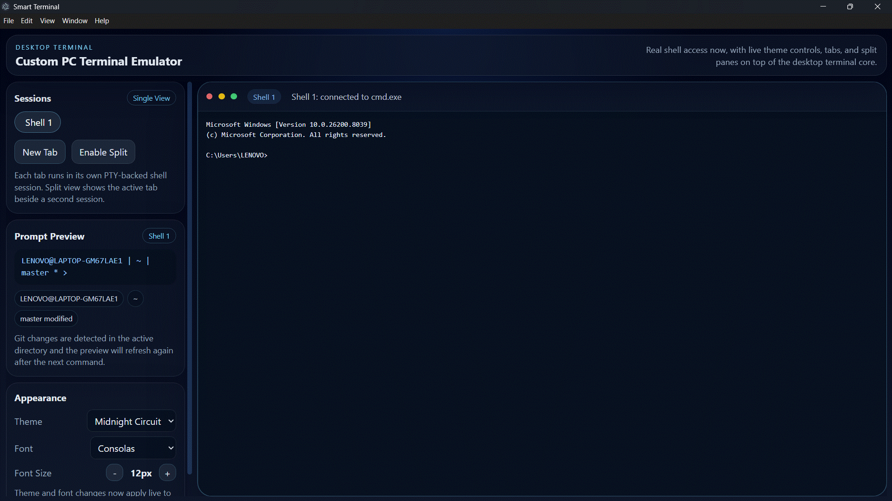
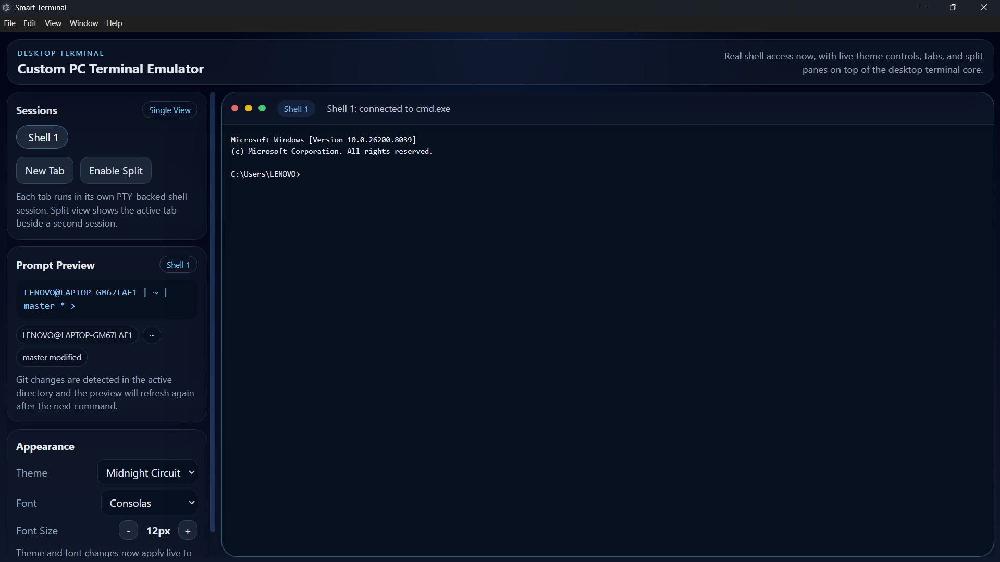
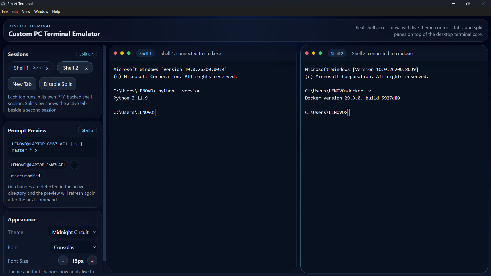
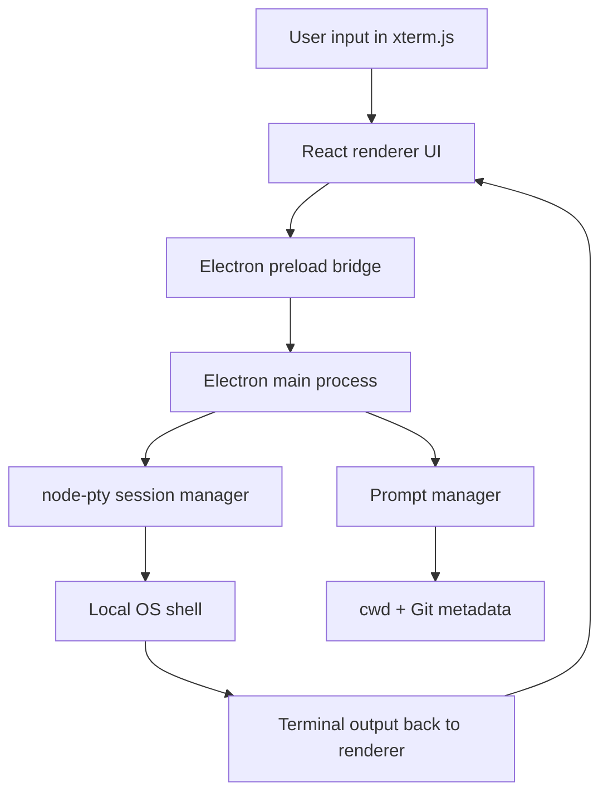

<p align="center">
  
</p>

<h1 align="center">Smart Terminal</h1>

<p align="center">
  Custom PC terminal emulator built with Electron, React, xterm.js, and node-pty.
</p>

<p align="center">
  Designed to go beyond a plain shell window with a cleaner desktop UI, PTY-backed sessions, split layouts, and prompt-aware developer context.
</p>

<p align="center">
  
  
  
  
  
</p>

> Smart Terminal currently focuses on the desktop shell experience. The `api/`, `db/`, `docker/`, and `n8n/` layers are already scaffolded in the repository for the next phases of the product.

## Demo

<p align="center">
  
</p>

## Screenshots

<table>
  <tr>
    <td width="50%">
      
    </td>
    <td width="50%">
      
    </td>
  </tr>
  <tr>
    <td align="center"><strong>Main Workspace UI</strong></td>
    <td align="center"><strong>Live Terminal Session</strong></td>
  </tr>
</table>

## Features

- Real shell integration through `node-pty`, connected to the local OS shell
- Multi-tab terminal workspace for running parallel sessions
- Split view layout for side-by-side shell workflows
- Live theme, font, and terminal appearance controls
- Prompt preview with user, host, current working directory, and Git branch or dirty state
- Clipboard-friendly copy, paste, and select-all shortcuts
- Resize-aware terminal rendering powered by xterm.js
- Windows-friendly development startup with automatic free-port selection
- Scaffolded foundations for Docker-backed sessions and n8n automation commands

## Feature Snapshot

| Area | Details |
| --- | --- |
| Terminal core | PTY-backed shell sessions rendered with xterm.js and dynamically resized with the UI |
| Workspace UI | React-based layout with tabs, split panes, prompt preview, and settings controls |
| Prompt intelligence | Tracks working directory plus Git branch and clean or dirty status |
| Desktop runtime | Electron main process with preload bridge and app-owned cache or session paths |
| Developer workflow | `npm run dev` starts Vite, waits for readiness, and launches Electron automatically |
| Future layers | Express routes, MongoDB scaffolding, Docker helpers, and n8n webhook integration are prepared |

## Architecture Overview



## Why This Project

- Replace a basic shell window with a more modern desktop developer experience
- Combine frontend UI, Electron desktop architecture, and system-level shell control in one project
- Build a practical foundation for backend persistence, container workflows, and automation features

## Tech Stack

- Frontend: React + Vite
- Desktop: Electron
- Terminal Engine: xterm.js
- Shell Bridge: node-pty
- Backend (scaffolded): Express.js
- Database (scaffolded): MongoDB
- Containers (scaffolded): Docker
- Automation (scaffolded): n8n

## Run Locally
- http://127.0.0.1:5173/

## You can always go back using:
-git restore . → undo current changes
-git reset --hard HEAD → last saved version
-git log + git reset → any old version

-git status
-git add README.md assets
-git commit -m "Improve README with screenshots and banner"
-git push

-git log --oneline
-4bbf6c6 (HEAD -> main) Initial commit - Smart Terminal project

### Prerequisites

- Node.js and npm
- Git installed if you want branch and working-tree status in the prompt preview
- Windows is the primary target right now; on Unix-like systems the PTY layer falls back to the system shell

### Development

```powershell
npm install
npm run dev
```

The dev runner automatically finds an open renderer port, starts Vite, and then launches Electron.

## Production Run

```powershell
npm start
```

This builds the renderer and launches the Electron entrypoint from the local workspace.

## Project Structure

```text
smart-terminal/
|-- electron/   # Electron main process, preload bridge, PTY and prompt managers
|-- src/        # React renderer, terminal UI, settings, themes, hooks
|-- api/        # Express routes for history, aliases, settings, and health checks
|-- db/         # MongoDB connection and model scaffolding
|-- docker/     # Docker integration scaffolding for container shell sessions
|-- n8n/        # Webhook integration scaffolding for automation commands
|-- scripts/    # Local development orchestration
```

## Project Status

| Phase | Scope | Status |
| --- | --- | --- |
| 1 | Working terminal foundation in Electron | Completed |
| 2 | UI, tabs, split panes, settings, and prompt preview | In progress |
| 3 | Local Express API and MongoDB persistence | Scaffolded |
| 4 | Docker container shell sessions | Scaffolded |
| 5 | Automation commands with n8n | Scaffolded |

## Running Notes

- On Windows, the app defaults to `cmd.exe`.
- Electron user data, session data, and cache paths are redirected into an app-owned directory.
- The prompt preview continues showing the last known directory and Git state after a session exits.

## Contributing

This is currently a personal project, but feedback, suggestions, and ideas are welcome.

## License

This project is released under the MIT License. See the [LICENSE](./LICENSE) file for details.
